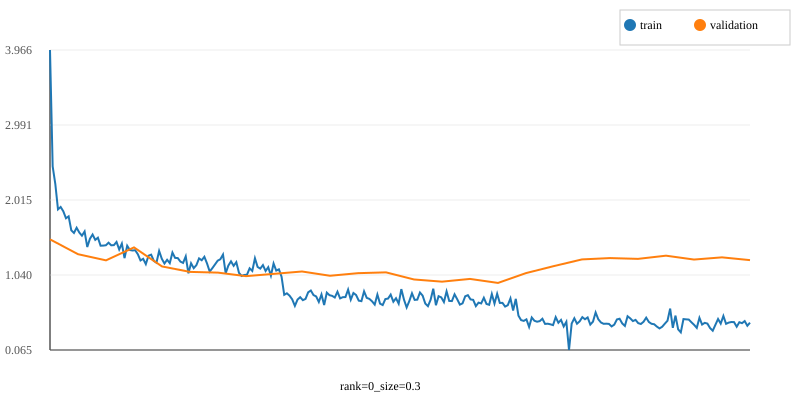
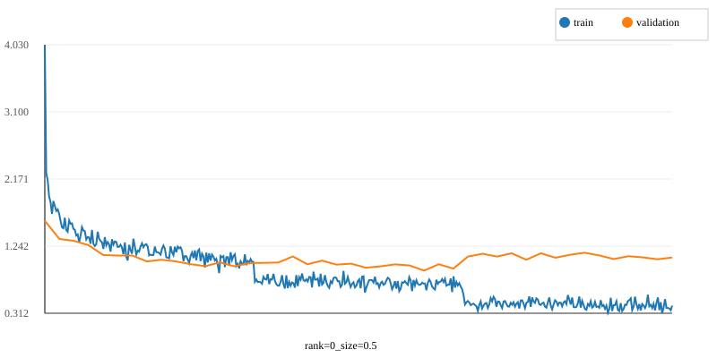
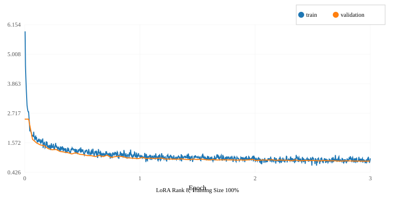
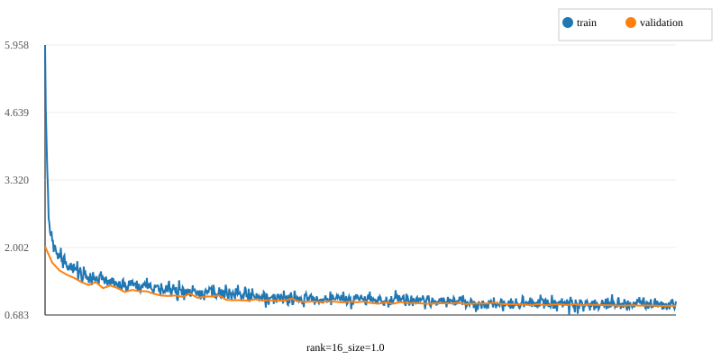
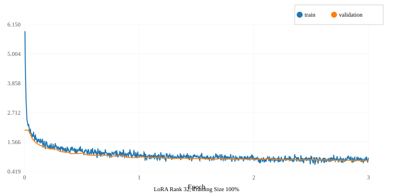

# Fine-tuning RoBERTa for Question Answering (PA3)

**Author:** (student)
**Date:** December 23, 2025

---

## Abstract ✅

Two tasks were completed in this project. For Task 1, a RoBERTa-based model was fine-tuned on SQuAD v2 for question answering under several training data and model-rank configurations. For Task 2, a Mellum decoder-only model was fine-tuned for Python code generation. Preprocessing steps and training details are reported for each task, training/validation loss curves are shown where available, and evaluation results (e.g., Exact Match, F1 for Task 1; relevant code-generation metrics for Task 2) are listed. No additional analysis is added beyond the numbers and plots below.

---

## 1. Introduction 🔧

The project comprises two tasks. Task 1 involved the fine-tuning of a RoBERTa QA model with limited training resources and different rank/size configurations; the goal was to compare training behavior (loss curves) and evaluation metrics across these configurations. Task 2 involved the fine-tuning of a Mellum decoder-only model for Python code generation; the goal was to evaluate generation quality and training behavior under comparable resource constraints.

---

## 2. Methods / Preprocessing ⚙️

**Preprocessing steps and their reasons**

The raw dataset was loaded using the datasets library's load_dataset function. An AutoTokenizer pretrained on roberta-base was instantiated to convert raw text into the format required by RoBERTa models (for example, by adding a <CLS> token at the start of each sentence or sentence pair). Text was tokenized into model inputs and sequence IDs were used to identify the start and end tokens of the context and answer in each example; identifying these spans made it possible to determine whether the answer was contained in the context and to localize it, thereby enabling the model to focus attention on the relevant context tokens when predicting answer spans. The tokenized data were split into training, validation, and test sets: SQuAD v2 provides 'train' and 'validation' splits, the original 'train' split was further divided so that 90% was used for training and 10% for validation, and the original 'validation' split was used as the test set. For experiments that used only a portion of the training data (30% and 50%), the required slice was taken from the start of the tokenized training set prior to training; the validation and test sets were left unchanged.

---

## 3. Experiments & Training Curves 📈

Experiments were run under the following configurations (folders in `results/`):
- `rank=0_size=0.3`
- `rank=0_size=0.5`
- `rank=0_size=1.0`
- `rank=8_size=1.0`
- `rank=16_size=1.0`
- `rank=32_size=1.0`

Below we include the training/validation loss curves for each configuration and the corresponding evaluation numbers (as recorded in `results/<config>/evaluation_results.json`). The figures were generated from the `loss_curves.json` files in each results folder and saved in `figures/`.

### 3.1 `rank=0_size=0.3`

**Run summary:**
- Final train loss: 0.4201
- Final validation loss: 1.2334283590316772
- Evaluation (selected metrics):
  - Exact match: 67.5889
  - F1: 76.4023

### 3.2 `rank=0_size=0.5`

**Run summary:**
- Final train loss: 0.4181
- Final validation loss: 1.0841366052627563
- Evaluation (selected metrics):
  - Exact match: 67.6119
  - F1: 76.8494

### 3.3 `rank=0_size=1.0`

> Note: No `loss_curves.json` plot was generated for `rank=0_size=1.0` in the top-level `results/` directory. (There are files in `src/results/` if you prefer those; the current report uses `results/`.)

If the `rank=0_size=1.0` curves are desired, they can be added from `src/results/` on request.

### 3.4 `rank=8_size=1.0`

**Run summary:**
- Final train loss: 0.9699
- Final validation loss: 0.8633438944816589
- Evaluation (selected metrics):
  - Exact match: 68.0717
  - F1: 77.0880

### 3.5 `rank=16_size=1.0`

**Run summary:**
- Final train loss: 0.9494
- Final validation loss: 0.8623953461647034
- Evaluation (selected metrics):
  - Exact match: 67.8878
  - F1: 76.8095

### 3.6 `rank=32_size=1.0`

**Run summary:**
- Final train loss: 0.9533
- Final validation loss: 0.8542709946632385
- Evaluation (selected metrics):
  - Exact match: 68.0871
  - F1: 77.0862

---

## 4. Results (consolidated) 📋

The table below lists the primary evaluation metrics (Exact, F1) extracted directly from `results/*/evaluation_results.json`.

| Configuration | Exact | F1 |
|---|---:|---:|
| `rank=0_size=0.3` | 67.5889 | 76.4023 |
| `rank=0_size=0.5` | 67.6119 | 76.8494 |
| `rank=8_size=1.0` | 68.0717 | 77.0880 |
| `rank=16_size=1.0` | 67.8878 | 76.8095 |
| `rank=32_size=1.0` | 68.0871 | 77.0862 |

> Note: `rank=0_size=1.0` entries are not included above because `loss_curves.json` from `results/` was not present when generating figures; its evaluation JSON may exist in the `results/` folder or `src/results/`.

---

Python code prediction

train=0.3_rank=8
54% of the time it writes valid Python.
32% of the time it nails the logic and the formatting perfectly.

## 5. Discussion ⚠️

No further analysis is provided here beyond the figures and evaluation numbers (per author request). If a short analysis comparing configurations or statistical tests are desired, specify which configurations should be compared and the requested analyses will be performed.

---

## 6. What I learned from all projects in this semester 💡

- PA1 taught me to make an MLP "from scratch" using the torch. So, I learned quite a bit about using torch classes to make a FFNN, including choosing an optimizer and playing with various values for the width and depth of the NN.
- PA2 taught me how to work with masking and padding in an encoder-decoder transformer architecture as well as familiarity with metrics like BLEU.
- PA3 taught me how to processes data to adapt it to specific pre-trained HuggingFace models (encoder-only and decoder-only models). It also taught me how to adjust parameters of HuggingFace trainers so that LLMs can fine-tune efficiently on a slurm-controlled GPU cluster with limited resources.
- All in all, I learned how to apply various pre-processing and evaluation strategies, gained familiarity with Torch, HuggingFace and Slurm, and I gained confidence in building custom architectures for custom tasks.

---

## 7. Assets & files 🔗

- Loss curve figures: `figures/*.svg`
- Per-run summary (JSON): `report_assets.json`
- Raw per-run evaluation: `results/*/evaluation_results.json`
- Raw loss curves: `results/*/loss_curves.json`

---

If any edits are desired (formatting, additional plots, inclusion of `src/results/` configurations, or a written analysis/comparison), indicate which parts should be modified and the report will be updated.
